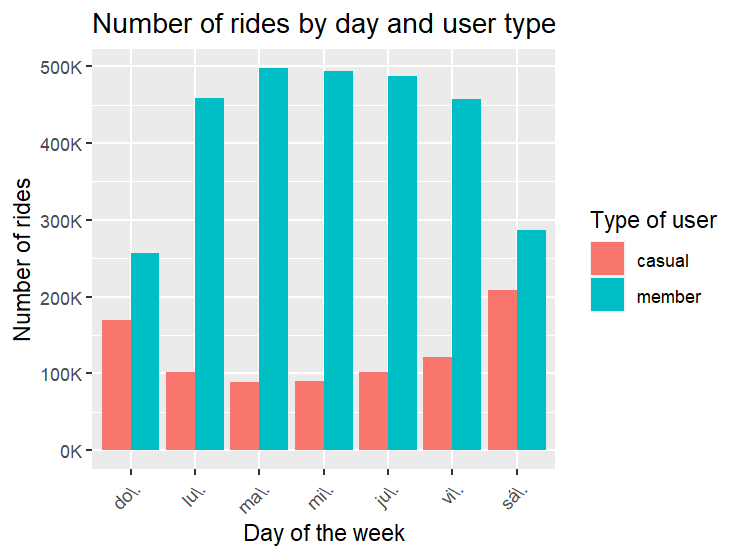
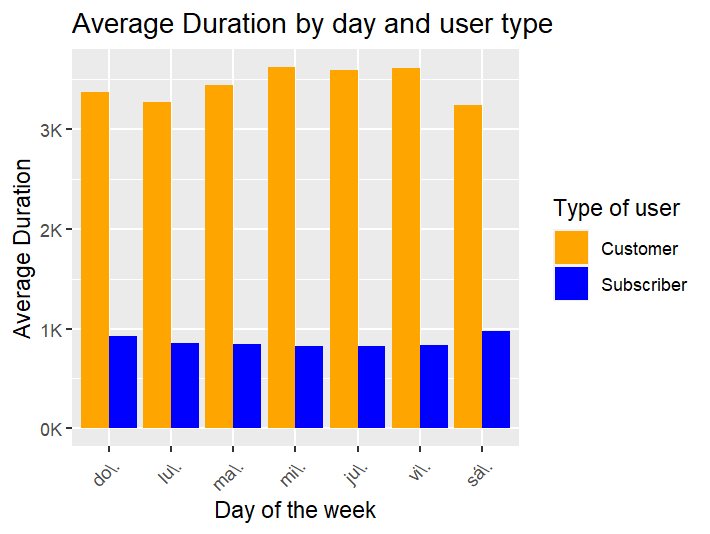
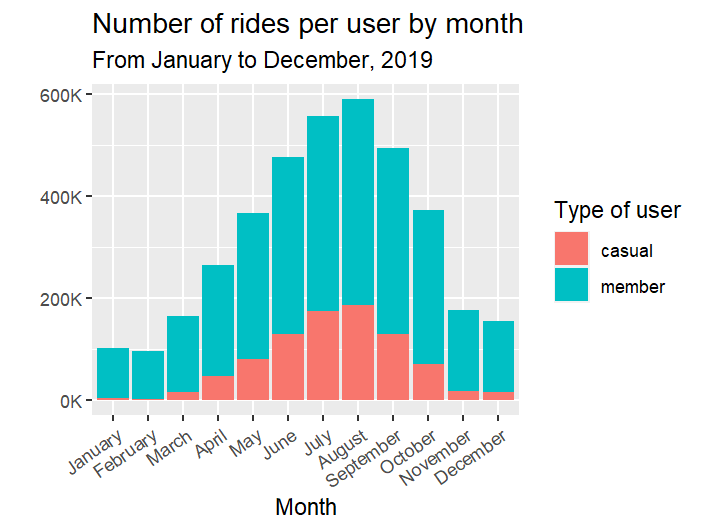

[Go back to portfolio][(https://arortega94.github.io/)]
# Data transformation using R and R Studio
## Data cleaning, processing, analyzing, visualizing and sharing using R Studio for a **shared bikes** company
### Context
I spearheaded a pivotal project aimed at **optimizing annual memberships** for sustained business success. I meticulously analyzed historical bike ride data from the entirety of 2019 in Chicago. My primary responsibility involved dissecting the differences between **occasional riders and annual members**, with the overarching goal of formulating data-driven marketing strategies. The resulting case study not only showcases my adeptness in extracting insights from data but also highlights my ability to develop strategic recommendations and present compelling visualizations. This project serves as a concrete representation of my analytical proficiency and strategic acumen **using R for data analysis**.

### Steps
1. Preparing the enviroment
2. Collecting data
3. Wrangling and merging multiple datasets into a master one
4. Cleaning up and preparing data for analysis
5. Conducting descriptive analysis
6. Creating visualizations
7. Conclussions

## 1. Preparing the enviroment
For this analysis we will be using the package **tidyverse**, so we will install it and load it.
```r
install.packages("tidyverse")
library(tidyverse)

> library(tidyverse)
── Attaching core tidyverse packages ───────────────────────────────────── tidyverse 2.0.0 ──
✔ dplyr     1.1.4     ✔ readr     2.1.4
✔ forcats   1.0.0     ✔ stringr   1.5.1
✔ ggplot2   3.4.4     ✔ tibble    3.2.1
✔ lubridate 1.9.3     ✔ tidyr     1.3.0
✔ purrr     1.0.2     
── Conflicts ─────────────────────────────────────────────────────── tidyverse_conflicts() ──
✖ dplyr::filter() masks stats::filter()
✖ dplyr::lag()    masks stats::lag()
ℹ Use the conflicted package to force all conflicts to become errors
```
## 2. Collecting data
The data is contained in 4 different files, one for each quarter of 2019. After downloading the files, we need to load them into R using the function *read_csv()*. We will add the data into 4 different data frames.

```r
q1_2019 <- read_csv("~/trip_data_2019/2019_Q1_trips.csv")
q2_2019 <- read_csv("~/trip_data_2019/2019_Q2_trips.csv")
q3_2019 <- read_csv("~/trip_data_2019/2019_Q3_trips.csv")
q4_2019 <- read_csv("~/trip_data_2019/2019_Q4_trips.csv")
```
No we have all 4 different data frames loaded in R. Let´s conduct a basic data inspection using data investigation functions:

```r
str(q1_2019)
tibble [365,069 × 12] (S3: tbl_df/tbl/data.frame)
 $ ride_id           : chr [1:365069] "21742443" "21742444" "21742445" "21742446" ...
 $ started_at        : POSIXct[1:365069], format: "2019-01-01 00:04:37" "2019-01-01 00:08:13" "2019-01-01 00:13:23" ...
 $ ended_at          : POSIXct[1:365069], format: "2019-01-01 00:11:07" "2019-01-01 00:15:34" "2019-01-01 00:27:12" ...
 $ rideable_type     : chr [1:365069] "2167" "4386" "1524" "252" ...
 $ tripduration      : num [1:365069] 390 441 829 1783 364 ...
 $ start_station_id  : num [1:365069] 199 44 15 123 173 98 98 211 150 268 ...
 $ start_station_name: chr [1:365069] "Wabash Ave & Grand Ave" "State St & Randolph St" "Racine Ave & 18th St" "California Ave & Milwaukee Ave" ...
 $ end_station_id    : num [1:365069] 84 624 644 176 35 49 49 142 148 141 ...
 $ end_station_name  : chr [1:365069] "Milwaukee Ave & Grand Ave" "Dearborn St & Van Buren St (*)" "Western Ave & Fillmore St (*)" "Clark St & Elm St" ...
 $ member_casual     : chr [1:365069] "Subscriber" "Subscriber" "Subscriber" "Subscriber" ...
 $ gender            : chr [1:365069] "Male" "Female" "Female" "Male" ...
 $ birthyear         : num [1:365069] 1989 1990 1994 1993 1994 ...
```
## 3. Wrangling and merging multiple datasets into a master one
To merge all frames into a single one for analysis, we need to make sure data integrity. Let's check the column names of the data sets:
```r
colnames(q3_2019)
 [1] "ride_id"            "started_at"         "ended_at"           "rideable_type"     
 [5] "tripduration"       "start_station_id"   "start_station_name" "end_station_id"    
 [9] "end_station_name"   "member_casual"      "gender"             "birthyear"         
> colnames(q4_2019)
 [1] "ride_id"            "started_at"         "ended_at"           "rideable_type"     
 [5] "tripduration"       "start_station_id"   "start_station_name" "end_station_id"    
 [9] "end_station_name"   "member_casual"      "gender"             "birthyear"         
> colnames(q2_2019)
 [1] "01 - Rental Details Rental ID"            "01 - Rental Details Local Start Time"
 [3] "01 - Rental Details Local End Time"       "01 - Rental Details Bike ID"     
 [5] "01 - Rental Details Duration In Seconds Uncapped"       "03 - Rental Start Station ID"
 [7] "03 - Rental Start Station Name" "02 - Rental End Station ID"    
 [9] "02 - Rental End Station Name"   "User Type"      "Member Gender"    "05 - Member Details Member Birthday Year"         
> colnames(q1_2019)
 [1] "ride_id"            "started_at"         "ended_at"           "rideable_type"     
 [5] "tripduration"       "start_station_id"   "start_station_name" "end_station_id"    
 [9] "end_station_name"   "member_casual"      "gender"             "birthyear"
```
As we can see, some column names, differ, so let's rename all of them as the ones in Q1 for consistency:
```r
(q4_2019 <- rename(q4_2019
                   ,ride_id = trip_id
                   ,started_at = start_time  
                   ,ended_at = end_time
                   ,rideable_type = bikeid
                   ,tripduration = tripduration
                   ,start_station_id = from_station_id  
                   ,start_station_name = from_station_name
                   ,end_station_id = to_station_id 
                   ,end_station_name = to_station_name,
                   ,member_casual = usertype
                   ,gender = gender
                   ,birthyear = birthyear))

(q3_2019 <- rename(q3_2019
                   ,ride_id = trip_id
                   ,started_at = start_time  
                   ,ended_at = end_time
                   ,rideable_type = bikeid
                   ,tripduration = tripduration
                   ,start_station_id = from_station_id  
                   ,start_station_name = from_station_name
                   ,end_station_id = to_station_id 
                   ,end_station_name = to_station_name,
                   ,member_casual = usertype
                   ,gender = gender
                   ,birthyear = birthyear))

(q2_2019 <- rename(q2_2019
                   ,ride_id = "01 - Rental Details Rental ID"
                   ,started_at = "01 - Rental Details Local Start Time"
                   ,ended_at = "01 - Rental Details Local End Time"
                   ,rideable_type = "01 - Rental Details Bike ID"  
                   ,tripduration = "01 - Rental Details Duration In Seconds Uncapped"
                   ,start_station_id = "03 - Rental Start Station ID"
                   ,start_station_name = "03 - Rental Start Station Name"
                   ,end_station_id = "02 - Rental End Station ID" 
                   ,end_station_name = "02 - Rental End Station Name"
                   ,member_casual = "User Type"
                   ,gender = "Member Gender"
                   ,birthyear = "05 - Member Details Member Birthday Year"))
(q1_2019 <- rename(q1_2019
                   ,ride_id = trip_id
                   ,started_at = start_time  
                   ,ended_at = end_time
                   ,rideable_type = bikeid
                   ,tripduration = tripduration
                   ,start_station_id = from_station_id  
                   ,start_station_name = from_station_name
                   ,end_station_id = to_station_id 
                   ,end_station_name = to_station_name,
                   ,member_casual = usertype
                   ,gender = gender
                   ,birthyear = birthyear))
```
Now, let's check back again:
```r
> colnames(q3_2019)
 [1] "ride_id"            "started_at"         "ended_at"           "rideable_type"     
 [5] "tripduration"       "start_station_id"   "start_station_name" "end_station_id"    
 [9] "end_station_name"   "member_casual"      "gender"             "birthyear"         
> colnames(q4_2019)
 [1] "ride_id"            "started_at"         "ended_at"           "rideable_type"     
 [5] "tripduration"       "start_station_id"   "start_station_name" "end_station_id"    
 [9] "end_station_name"   "member_casual"      "gender"             "birthyear"         
> colnames(q2_2019)
 [1] "ride_id"            "started_at"         "ended_at"           "rideable_type"     
 [5] "tripduration"       "start_station_id"   "start_station_name" "end_station_id"    
 [9] "end_station_name"   "member_casual"      "gender"             "birthyear"         
> colnames(q1_2019)
 [1] "ride_id"            "started_at"         "ended_at"           "rideable_type"     
 [5] "tripduration"       "start_station_id"   "start_station_name" "end_station_id"    
 [9] "end_station_name"   "member_casual"      "gender"             "birthyear"
```
And finally, let's merge all the datasets into one called "all_trips":
```r
all_trips <- bind_rows(q1_2019, q2_2019, q3_2019, q4_2019)
```
We can see the file merge correctly, and is now a file which contains 13 columns and 3,818,004 observations.
```r
glimpse(all_trips)
Rows: 3,818,004
Columns: 13
$ ride_id            <chr> "21742443", "21742444", "21742445", "21742446", "21742447", "217…
$ started_at         <dttm> 2019-01-01 00:04:37, 2019-01-01 00:08:13, 2019-01-01 00:13:23, …
$ ended_at           <dttm> 2019-01-01 00:11:07, 2019-01-01 00:15:34, 2019-01-01 00:27:12, …
$ rideable_type      <chr> "2167", "4386", "1524", "252", "1170", "2437", "2708", "2796", "…
$ tripduration       <dbl> 390, 441, 829, 1783, 364, 216, 177, 100, 1727, 336, 886, 653, 60…
$ start_station_id   <dbl> 199, 44, 15, 123, 173, 98, 98, 211, 150, 268, 299, 204, 90, 90, …
$ start_station_name <chr> "Wabash Ave & Grand Ave", "State St & Randolph St", "Racine Ave …
$ end_station_id     <dbl> 84, 624, 644, 176, 35, 49, 49, 142, 148, 141, 295, 420, 255, 255…
$ end_station_name   <chr> "Milwaukee Ave & Grand Ave", "Dearborn St & Van Buren St (*)", "…
$ member_casual      <chr> "member", "member", "member", "member", "member", "member", "mem…
$ gender             <chr> "Male", "Female", "Female", "Male", "Male", "Female", "Male", "M…
$ birthyear          <dbl> 1989, 1990, 1994, 1993, 1994, 1983, 1984, 1990, 1995, 1996, 1994…
$ date               <date> 2019-01-01, 2019-01-01, 2019-01-01, 2019-01-01, 2019-01-01, 201…
```
## 4. Cleaning up and preparing data for analysis
Let's inspect the data thoroughly to clean up any inconsistencies with the data or the observations. We will use the following functions:
```r
colnames(all_trips)  #List of column names
nrow(all_trips)  #How many rows are in data frame?
dim(all_trips)  #Dimensions of the data frame?
head(all_trips)  #See the first 6 rows of data frame
tail(all_trips) #See the last rows
str(all_trips)  #See list of columns and data types (numeric, character, etc)
summary(all_trips)  #Statistical summary of data. Mainly for numerics

colnames(all_trips)  #List of column names
 [1] "ride_id"            "started_at"         "ended_at"           "rideable_type"     
 [5] "tripduration"       "start_station_id"   "start_station_name" "end_station_id"    
 [9] "end_station_name"   "member_casual"      "gender"             "birthyear"         
[13] "date"

> nrow(all_trips)  #How many rows are in data frame?
[1] 3818004

> dim(all_trips)  #Dimensions of the data frame?
[1] 3818004      13

> head(all_trips)  #See the first 6 rows of data frame
# A tibble: 6 × 18
  ride_id started_at          ended_at            rideable_type tripduration start_station_id
  <chr>   <dttm>              <dttm>              <chr>                <dbl>            <dbl>
1 217424… 2019-01-01 00:04:37 2019-01-01 00:11:07 2167                   390              199
2 217424… 2019-01-01 00:08:13 2019-01-01 00:15:34 4386                   441               44
3 217424… 2019-01-01 00:13:23 2019-01-01 00:27:12 1524                   829               15
4 217424… 2019-01-01 00:13:45 2019-01-01 00:43:28 252                   1783              123
5 217424… 2019-01-01 00:14:52 2019-01-01 00:20:56 1170                   364              173
6 217424… 2019-01-01 00:15:33 2019-01-01 00:19:09 2437                   216               98
# ℹ 7 more variables: start_station_name <chr>, end_station_id <dbl>,
#   end_station_name <chr>, member_casual <chr>, gender <chr>, birthyear <dbl>, date <date>

> tail(all_trips) #See the last rows
# A tibble: 6 × 13
  ride_id started_at          ended_at            rideable_type tripduration start_station_id
  <chr>   <dttm>              <dttm>              <chr>                <dbl>            <dbl>
1 259628… 2019-12-31 23:54:54 2020-01-01 00:22:02 5996                  1628              145
2 259629… 2019-12-31 23:56:13 2020-01-01 00:15:45 2196                  1172              112
3 259629… 2019-12-31 23:56:34 2020-01-01 00:22:08 4877                  1533               90
4 259629… 2019-12-31 23:57:05 2020-01-01 00:05:46 863                    520              623
5 259629… 2019-12-31 23:57:11 2020-01-01 00:05:45 2637                   514              623
6 259629… 2019-12-31 23:57:17 2019-12-31 23:59:18 5930                   120              256
# ℹ 7 more variables: start_station_name <chr>, end_station_id <dbl>,
#   end_station_name <chr>, member_casual <chr>, gender <chr>, birthyear <dbl>, date <date>

> str(all_trips)  #See list of columns and data types (numeric, character, etc)
tibble [3,818,004 × 13] (S3: tbl_df/tbl/data.frame)
 $ ride_id           : chr [1:3818004] "21742443" "21742444" "21742445" "21742446" ...
 $ started_at        : POSIXct[1:3818004], format: "2019-01-01 00:04:37" "2019-01-01 00:08:13" "2019-01-01 00:13:23" ...
 $ ended_at          : POSIXct[1:3818004], format: "2019-01-01 00:11:07" "2019-01-01 00:15:34" "2019-01-01 00:27:12" ...
 $ rideable_type     : chr [1:3818004] "2167" "4386" "1524" "252" ...
 $ tripduration      : num [1:3818004] 390 441 829 1783 364 ...
 $ start_station_id  : num [1:3818004] 199 44 15 123 173 98 98 211 150 268 ...
 $ start_station_name: chr [1:3818004] "Wabash Ave & Grand Ave" "State St & Randolph St" "Racine Ave & 18th St" "California Ave & Milwaukee Ave" ...
 $ end_station_id    : num [1:3818004] 84 624 644 176 35 49 49 142 148 141 ...
 $ end_station_name  : chr [1:3818004] "Milwaukee Ave & Grand Ave" "Dearborn St & Van Buren St (*)" "Western Ave & Fillmore St (*)" "Clark St & Elm St" ...
 $ member_casual     : chr [1:3818004] "member" "member" "member" "member" ...
 $ gender            : chr [1:3818004] "Male" "Female" "Female" "Male" ...
 $ birthyear         : num [1:3818004] 1989 1990 1994 1993 1994 ...
 $ date              : Date[1:3818004], format: "2019-01-01" "2019-01-01" "2019-01-01" ...

> summary(all_trips)  #Statistical summary of data. Mainly for numerics
   ride_id            started_at                        ended_at                     
 Length:3818004     Min.   :2019-01-01 00:04:37.00   Min.   :2019-01-01 00:11:07.00  
 Class :character   1st Qu.:2019-05-29 15:49:26.50   1st Qu.:2019-05-29 16:09:28.25  
 Mode  :character   Median :2019-07-25 17:50:54.00   Median :2019-07-25 18:12:23.00  
                    Mean   :2019-07-19 21:47:37.11   Mean   :2019-07-19 22:11:47.56  
                    3rd Qu.:2019-09-15 06:48:05.75   3rd Qu.:2019-09-15 08:30:13.25  
                    Max.   :2019-12-31 23:57:17.00   Max.   :2020-01-21 13:54:35.00  
                                                                                     
 rideable_type       tripduration      start_station_id start_station_name end_station_id 
 Length:3818004     Min.   :      61   Min.   :  1.0    Length:3818004     Min.   :  1.0  
 Class :character   1st Qu.:     411   1st Qu.: 77.0    Class :character   1st Qu.: 77.0  
 Mode  :character   Median :     709   Median :174.0    Mode  :character   Median :174.0  
                    Mean   :    1450   Mean   :201.7                       Mean   :202.6  
                    3rd Qu.:    1283   3rd Qu.:289.0                       3rd Qu.:291.0  
                    Max.   :10628400   Max.   :673.0                       Max.   :673.0  
                                                                                          
 end_station_name   member_casual         gender            birthyear     
 Length:3818004     Length:3818004     Length:3818004     Min.   :1759    
 Class :character   Class :character   Class :character   1st Qu.:1979    
 Mode  :character   Mode  :character   Mode  :character   Median :1987    
                                                          Mean   :1984    
                                                          3rd Qu.:1992    
                                                          Max.   :2014    
                                                          NA's   :538751  
      date                
 Min.   :2019-01-01   
 1st Qu.:2019-05-29 
 Median :2019-07-25   
 Mean   :2019-07-19                                                           
 3rd Qu.:2019-09-15                                                           
 Max.   :2019-12-31                                                           
                                                                               
```
For clarity purposes, let's change the "member" to "Subscriber" and the "casual" to "Customer":
```r
all_trips <-  all_trips %>% 
  mutate(member_casual = recode(member_casual
                                ,"Subscriber" = "member"
                                ,"Customer" = "casual"))
# Then, let's check the number of observations is correct:
> table(all_trips$member_casual)

 Customer  Subscriber 
 880637    2937367
```
Now, for granularity, let's add several columns with the year, month and date for each ride separately:
```r
all_trips$date <- as.Date(all_trips$started_at) #The default format is yyyy-mm-dd
all_trips$month <- format(as.Date(all_trips$date), "%m")
all_trips$day <- format(as.Date(all_trips$date), "%d")
all_trips$year <- format(as.Date(all_trips$date), "%Y")
all_trips$day_of_week <- format(as.Date(all_trips$date), "%A")
```
And then let's add a ride length calculation in seconds for further analysis:
```r
all_trips$ride_length <- difftime(all_trips$ended_at,all_trips$started_at, units = "secs")
```
Now, let's convert the data type of ride_length to numeric so we can run calculations on the data:
```r
is.factor(all_trips$ride_length)
all_trips$ride_length <- as.numeric(as.character(all_trips$ride_length))
is.numeric(all_trips$ride_length)
```
And let's check the structure of the data set for safety:
```r
> str(all_trips)
tibble [3,818,004 × 18] (S3: tbl_df/tbl/data.frame)
 $ ride_id           : chr [1:3818004] "21742443" "21742444" "21742445" "21742446" ...
 $ started_at        : POSIXct[1:3818004], format: "2019-01-01 00:04:37" "2019-01-01 00:08:13" ...
 $ ended_at          : POSIXct[1:3818004], format: "2019-01-01 00:11:07" "2019-01-01 00:15:34" ...
 $ rideable_type     : chr [1:3818004] "2167" "4386" "1524" "252" ...
 $ tripduration      : num [1:3818004] 390 441 829 1783 364 ...
 $ start_station_id  : num [1:3818004] 199 44 15 123 173 98 98 211 150 268 ...
 $ start_station_name: chr [1:3818004] "Wabash Ave & Grand Ave" "State St & Randolph St" "Racine Ave & 18th St" "California Ave & Milwaukee Ave" ...
 $ end_station_id    : num [1:3818004] 84 624 644 176 35 49 49 142 148 141 ...
 $ end_station_name  : chr [1:3818004] "Milwaukee Ave & Grand Ave" "Dearborn St & Van Buren St (*)" "Western Ave & Fillmore St (*)" "Clark St & Elm St" ...
 $ member_casual     : chr [1:3818004] "member" "member" "member" "member" ...
 $ gender            : chr [1:3818004] "Male" "Female" "Female" "Male" ...
 $ birthyear         : num [1:3818004] 1989 1990 1994 1993 1994 ...
 $ date              : Date[1:3818004], format: "2019-01-01" "2019-01-01" ...
 $ month             : chr [1:3818004] "01" "01" "01" "01" ...
 $ day               : chr [1:3818004] "01" "01" "01" "01" ...
 $ year              : chr [1:3818004] "2019" "2019" "2019" "2019" ...
 $ day_of_week       : chr [1:3818004] "martes" "martes" "martes" "martes" ...
 $ ride_length       : num [1:3818004] 390 441 829 1783 364 ...
```
And finally, before running the analysis, I realised there are some observations when bikes were taken out of docks and checked for quality by Divvy or ride_length was negative. Since some data is being removed, we will create a second version of the data frame:
```r
all_trips_v2 <- all_trips[!(all_trips$start_station_name == "HQ QR" | all_trips$ride_length<0),]
```
## 5. Conducting descriptive analysis
Let's run some basic statistical calculations on ride_length:
```r
> mean(all_trips_v2$ride_length) #straight average (total ride length / rides)
[1] 1450.466
> median(all_trips_v2$ride_length) #midpoint number in the ascending array of ride lengths
[1] 709
> max(all_trips_v2$ride_length) #longest ride
[1] 10632022
> min(all_trips_v2$ride_length) #shortest rid
[1] 61
```
Which can also be obtained with the summary function:
```r
> summary(all_trips_v2$ride_length)
    Min.  1st Qu.   Median     Mean  3rd Qu.     Max. 
      61      411      709     1450     1284 10632022
```
Now, we are getting closer to the actual problem of the case study. Let's compare the 2 types of users:
```r
aggregate(all_trips_v2$ride_length ~ all_trips_v2$member_casual, FUN = mean)
aggregate(all_trips_v2$ride_length ~ all_trips_v2$member_casual, FUN = median)
aggregate(all_trips_v2$ride_length ~ all_trips_v2$member_casual, FUN = max)
aggregate(all_trips_v2$ride_length ~ all_trips_v2$member_casual, FUN = min)

> aggregate(all_trips_v2$ride_length ~ all_trips_v2$member_casual, FUN = mean)
  all_trips_v2$member_casual all_trips_v2$ride_length
1                     Customer                3421.0811
2                     Subscriber              859.6681
> aggregate(all_trips_v2$ride_length ~ all_trips_v2$member_casual, FUN = median)
  all_trips_v2$member_casual all_trips_v2$ride_length
1                     Customer                 1550
2                     Subscriber               588
> aggregate(all_trips_v2$ride_length ~ all_trips_v2$member_casual, FUN = max)
  all_trips_v2$member_casual all_trips_v2$ride_length
1                     Customer                 10632022
2                     Subscriber               9056634
> aggregate(all_trips_v2$ride_length ~ all_trips_v2$member_casual, FUN = min)
  all_trips_v2$member_casual all_trips_v2$ride_length
1                     Customer                  61
2                     Subscriber                61
```
We can already see some interesting insights:
1. The Subscriber has in average shorter rides, which might be caused due to the nature of the casual tickets, which are min. 1 hour, max. 1 day.
2. The max time for a ride length is way bigger in Customers, which confirms our initial hypothesis.

Let's see the average ride time by each day for Subscribers vs Customers
```r
aggregate(all_trips_v2$ride_length ~ all_trips_v2$member_casual + all_trips_v2$day_of_week, FUN = mean)

> aggregate(all_trips_v2$ride_length ~ all_trips_v2$member_casual + all_trips_v2$day_of_week, FUN = mean)
   all_trips_v2$member_casual all_trips_v2$day_of_week all_trips_v2$ride_length
1                      Customer                  Sunday                3371.1117
2                      Subscriber                  Sunday                 924.1741
3                      Customer                    Monday                3269.9934
4                      Subscriber                    Monday                 854.9570
5                      Customer                   Tuesday                3444.7970
6                      Subscriber                   Tuesday                 849.1555
7                      Customer                Wednesday                3620.0440
8                      Subscriber                Wednesday                 828.5907
9                      Customer                   Thursday                3597.0674
10                     Subscriber                   Thursday                 826.7875
11                     Customer                  Friday                3610.5366
12                     Subscriber                  Friday                 833.8487
13                     Customer                   Saturday                3243.6666
14                     Subscriber                   Saturday                 978.1623
```
We can check the pattern is repeats. In addittion, we can see that Wednesday and Fridays are the days with the most rides for Customers, while Saturday and Sundays are for Subscribers.

Let's try to aggregate both calculations together under one table:
```r
all_trips_v2 %>% 
  mutate(weekday = wday(started_at, label = TRUE)) %>%  #creates weekday field using wday()
  group_by(member_casual, weekday) %>%  #groups by usertype and weekday
  summarise(number_of_rides = n()							#calculates the number of rides and average duration 
            ,average_duration = mean(ride_length)) %>% 		# calculates the average duration
  arrange(member_casual, weekday)								# sorts

summarise()` has grouped output by 'member_casual'. You can override using the
`.groups` argument.
# A tibble: 14 × 4
# Groups:   member_casual [2]
   member_casual weekday   number_of_rides average_duration
   <chr>         <ord>             <int>            <dbl>
 1 Customer        "do\\."          170173            3371.
 2 Customer        "lu\\."          101489            3270.
 3 Customer        "ma\\."           88655            3445.
 4 Customer        "mi\\."           89745            3620.
 5 Customer        "ju\\."          101372            3597.
 6 Customer        "vi\\."          121141            3611.
 7 Customer        "sá\\."          208056            3244.
 8 Subscriber      "do\\."          256234             924.
 9 Subscriber      "lu\\."          458780             855.
10 Subscriber      "ma\\."          497025             849.
11 Subscriber      "mi\\."          494277             829.
12 Subscriber      "ju\\."          486915             827.
13 Subscriber      "vi\\."          456966             834.
14 Subscriber      "sá\\."          287163             978.
```
And finnaly let's calculate the number of trips per user per month for later on analysis:
```r
trips_per_user_per_month <- all_trips_v2 %>%
  group_by(member_casual, month) %>%
  summarise(ride_id = n()) %>% 
  rename(number_of_rides = ride_id)
```
This way we can confirm the patters we were seeing before:
1. Customers take almost 3 times more rides than Subscribers
2. Customers have longer rides than Subscribers, almost 3 times longer
## 6. Creating visualizations
And finally, let's create some visualizations to share them with the stakeholders, using the package ggplot2
```r
all_trips_v2 %>% 
  mutate(weekday = wday(started_at, label = TRUE)) %>% 
  group_by(member_casual, weekday) %>% 
  summarise(number_of_rides = n()
            ,average_duration = mean(ride_length)) %>% 
  arrange(member_casual, weekday)  %>% 
  ggplot(aes(x = weekday, y = number_of_rides, fill = member_casual)) +
  geom_col(position = "dodge") +
  labs(title = "Number of rides by day and user type",
       x = "Day of the week",
       y = "Number of rides")+
  guides(fill = guide_legend(title = "Type of user"))+
  theme(axis.text.x = element_text(angle = 45, hjust = 1))+
  scale_y_continuous(labels = scales::label_number(scale = 1e-3, suffix = "K"))
```


And finally, let's create another column chart to visualize the **Avergae ride length** by day of the week and user type:
```r
all_trips_v2 %>% 
  mutate(weekday = wday(started_at, label = TRUE)) %>% 
  group_by(member_casual = ifelse(member_casual == "member", "Subscriber", "Customer"), weekday) %>% 
  summarise(number_of_rides = n(),
            average_duration = mean(ride_length)) %>% 
  arrange(member_casual, weekday)  %>% 
  ggplot(aes(x = weekday, y = average_duration, fill = member_casual)) +
  geom_col(position = "dodge") +
  labs(title = "Average Duration by day and user type",
       x = "Day of the week",
       y = "Average Duration") +
  theme(axis.text.x = element_text(angle = 45, hjust = 1)) +
  scale_fill_manual(values = c("Subscriber" = "blue", "Customer" = "orange")) +
  guides(fill = guide_legend(title = "Type of user")) +
  scale_y_continuous(labels = scales::label_number(scale = 1e-3, suffix = "K"))
```


And let's take a look to the distribution of rides per usertype and month of the year:
```r
trips_per_user_per_month %>%
  ggplot() + 
  geom_col(mapping = aes(x = month, y = number_of_rides, fill = member_casual),
           position = position_stack(reverse = TRUE)) +
  labs(title = "Number of rides per user by month",
       subtitle = "From January to December, 2019",
       y = " ") +
  scale_fill_discrete(name = "Type of user") +
  scale_x_discrete(name = "Month", labels = month.name) +
  scale_y_continuous(labels = scales::label_number(scale = 1e-3, suffix = "K")) +
  theme(axis.text.x = element_text(angle = 35, hjust = 1))
```


## 7. Conclussions
The summary of the insights we can obtain through this analysis are the following:
1. Customers take almost 3 times more rides than Subscribers
2. Customers have longer rides than Subscribers, almost 3 times longer
3. The most popular months to take rides are July and August
4. The least popular months are February and January

[Go back to portfolio][(https://arortega94.github.io/)]
